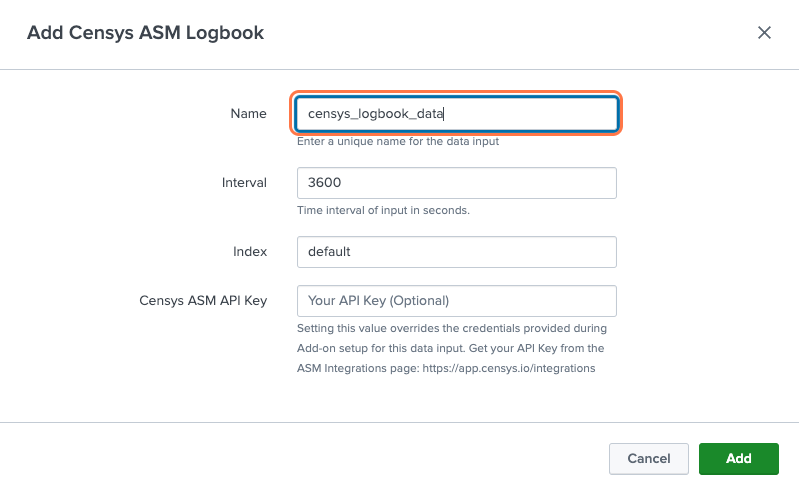

Censys Add-on for Splunk
========================

The Censys Add-on for Splunk allows Censys ASM users to import Logbook and Risks data into Splunk®, where changes in their attack surface can be easily directed to downstream security and analytics applications.

This guide will help you:

- Install the Censys Add-on in your Splunk environment
- Configure the Censys Add-on
- Use the Censys Add-on to monitor your attack surface

Splunkbase: `Censys Add-on for Splunk <https://splunkbase.splunk.com/app/6399/>`__

Add-on Prerequisites
--------------------

1. Your Censys ASM API key

    Find your key on the Censys ASM `integrations page <https://app.censys.io/integrations/>`__.

    .. image:: ../_static/asm_api_key.png

2. A Splunk account and installation.

Install the Censys Add-on for Splunk
------------------------------------

Install from Splunkbase
^^^^^^^^^^^^^^^^^^^^^^^

1. From the Splunk main page, click the **+ Find More Apps** button in the sidebar.

    .. image:: ../_static/find_more_apps.png

2. Type "Censys in the search bar.

3. On the results page, find the "Censys Add-on for Splunk" app card and click the green **Install** button.

    .. TODO add image here

4. Reenter login credentials to confirm your choice.

Configure the Add-on
--------------------

Logbook
^^^^^^^

From the Inputs page, select Create New Input. Fill out the following fields:

- Name for your data input
- Censys ASM API key from the Censys ASM `integrations page <https://app.censys.io/integrations/>`__
- Adjust the Interval field if desired. This determines how frequently data will be fetched from Censys ASM.

.. TODO: say anything about default index?

.. seealso::

    For more information on logbook events, visit our `Logbook Event Catalog <https://support.censys.io/hc/en-us/articles/4412836964244-Logbook-Event-Catalog-Reference->`_.

Risks
^^^^^

.. todo::

    Coming soon...

Use the Add-on
--------------

Under the Search tab, you can enter queries on your data inputs.
If you are not familiar with Splunk search syntax, Splunk has the following helpful resources:

- `Splunk Search Documentation <https://docs.splunk.com/Documentation/Splunk/8.2.5/Search/GetstartedwithSearch?ref=hk/>`_
- `Splunk Search Tutorial <https://docs.splunk.com/Documentation/Splunk/8.2.5/SearchTutorial/WelcometotheSearchTutorial?ref=hk/>`_

FAQs
----

What if I'm seeing no events in my index?
^^^^^^^^^^^^^^^^^^^^^^^^^^^^^^^^^^^^^^^^^

1. Confirm your :ref:`Censys ASM API key <Add-on Prerequisites>` is up to date

2. Confirm your index is accessible
