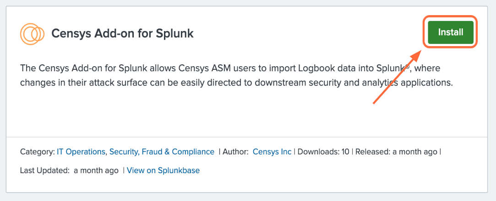
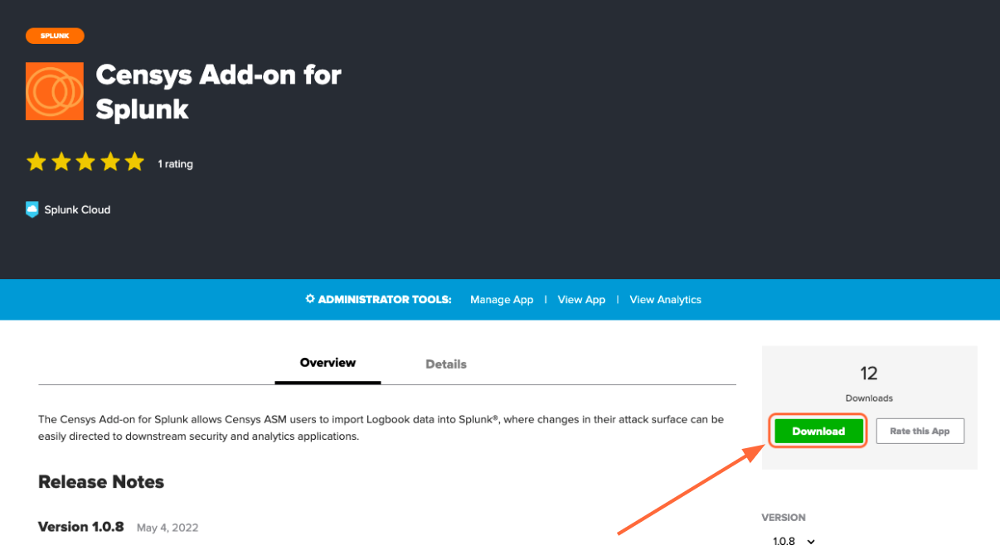
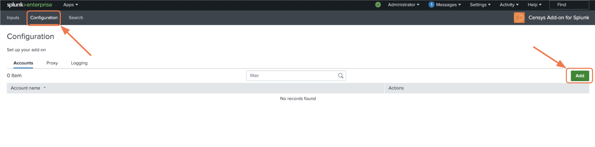
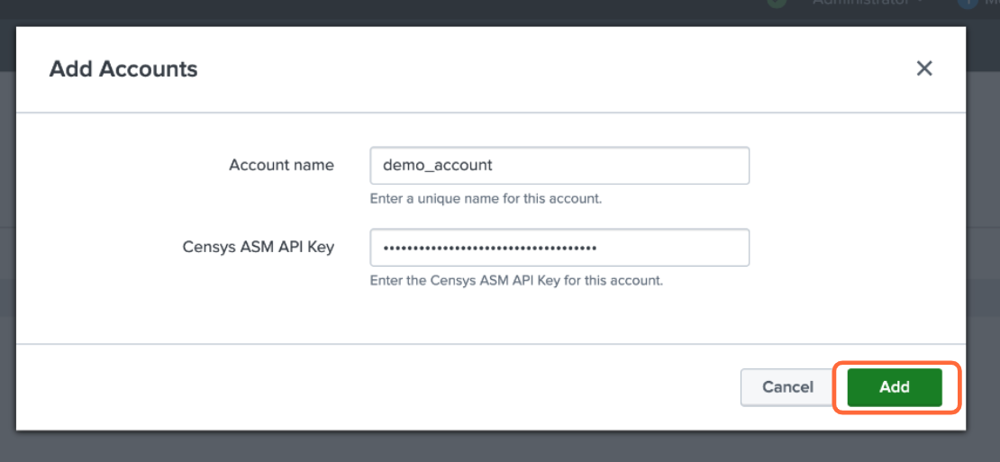
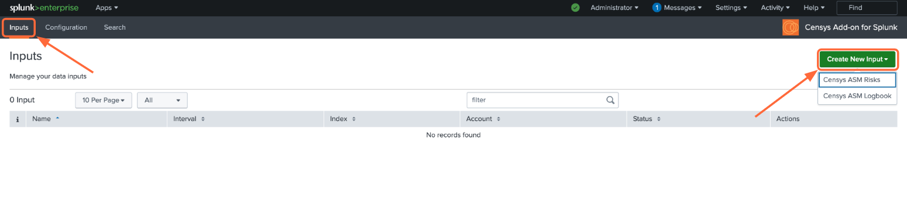
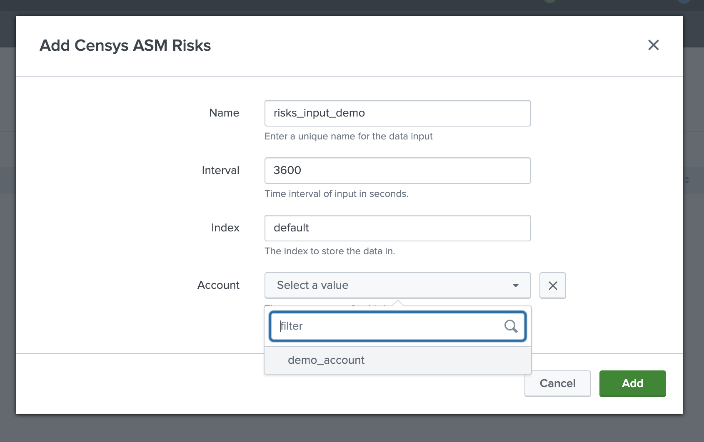

Censys Add-on for Splunk
========================

The Censys Add-on for Splunk allows Censys ASM users to import Logbook and Risks data into Splunk®, where changes in their attack surface can be easily directed to downstream security and analytics applications.

This guide will help you:

- Install the Censys Add-on in your Splunk environment
- Configure the Censys Add-on
- Use the Censys Add-on to monitor your attack surface

Splunkbase: |splunkbase_addon|

.. |splunkbase_addon| raw:: html

    <a href="https://splunkbase.splunk.com/app/6399/" target="_blank">Censys Add-on for Splunk</a>

--------

Add-on Prerequisites
--------------------

1. Your Censys ASM API key

    Find your key on the Censys ASM |integrations_page|.

    .. |integrations_page| raw:: html

        <a href="https://app.censys.io/integrations/" target="_blank">integrations page</a>

.. image:: ../_static/asm_api_key.png

2. A Splunk account and installation.

--------

Install the Censys Add-on for Splunk
-------------------------------------

Install from Splunkbase (Recommended)
^^^^^^^^^^^^^^^^^^^^^^^^^^^^^^^^^^^^^

1. From the Splunk main page, click the **+ Find More Apps** button in the sidebar.

.. image:: ../_static/find_more_apps.png

2. Type "Censys" in the search bar.

3. On the results page, find the "Censys Add-on for Splunk" app card and click the green **Install** button.

4. Reenter login credentials to confirm your choice.

Install from File
^^^^^^^^^^^^^^^^^

1. Go to the Add-on's page on `Splunkbase <https://splunkbase.splunk.com/app/6399/>`__ and click the **Download** button.

2. From the Splunk Web main page, click the gear icon next to **Apps**, then click **Install app from file**.

.. image:: ../_static/install_from_file.png

--------

Configure the Add-on
--------------------

Global Settings
^^^^^^^^^^^^^^^

If you will be using the same Censys workspace for all Splunk work, you can enter your Censys ASM API key in one place, rather than for each input.

1. Click on the Configuration tab at the top of the page

2. Under the Accounts tab, you will see all of your configured accounts. Click "Add" to configure a new account.

3. Enter a name for this account (the name of your ASM workspace is a good choice) and enter your Censys ASM API key (check out :ref:`add-on/index:add-on prerequisites` for help finding this)

Inputs
^^^^^^

From the Inputs page, select Create New Input. Select the API you would like to pull from.

Fill out the following fields:

- Input Name (required): A name for the input
- Interval (in seconds): How often the input should run (default is 3600 seconds, or 1 hour)
- Index: The index where the data will be stored
- Account: The Censys account to use (if you have multiple accounts)

.. seealso::

    For more information on logbook events, visit our |logbook_event_catalog|.

    .. |logbook_event_catalog| raw:: html

        <a href="https://support.censys.io/hc/en-us/articles/4412836964244-Logbook-Event-Catalog-Reference" target="_blank">Logbook Event Catalog</a>

Use the Add-on
--------------

Download our :ref:`Censys ASM App for Splunk<asm-app/index:censys asm app for splunk>`!

Under the Search tab, you can enter queries on your data inputs.
If you are not familiar with Splunk search syntax, Splunk has the following helpful resources:

- |splunk_search_doc|

.. |splunk_search_doc| raw:: html

    <a href="https://docs.splunk.com/Documentation/Splunk/9.0.2/Search/GetstartedwithSearch?ref=hk/" target="_blank">Splunk Search Documentation</a>

- |splunk_search_tutorial|

.. |splunk_search_tutorial| raw:: html

    <a href="https://docs.splunk.com/Documentation/Splunk/9.0.2/SearchTutorial/WelcometotheSearchTutorial?ref=hk/" target="_blank">Splunk Search Tutorial</a>

--------

FAQs
----

What if I'm seeing no events in my index?
^^^^^^^^^^^^^^^^^^^^^^^^^^^^^^^^^^^^^^^^^

1. Confirm your :ref:`Censys ASM API key <add-on/index:add-on prerequisites>` is up to date

2. Confirm your index is accessible
