Censys ASM App for Splunk
=========================

The Censys ASM App for Splunk allows ASM users to visualized Logbook API data with a pre-built dashboard that can be customized with additional views.

    **Note**: This app is dependent on |splunkbase_addon|.

    .. |splunkbase_addon| raw:: html

        <a href="https://splunkbase.splunk.com/app/6399/" target="_blank">Censys Add-on for Splunk</a>

This guide will help you:

- Set up the Censys Add-on for Splunk (if you haven't already)
- View our Attack Surface Management dashboard and create your own dashboards
- Set up reports and alerting
- Move seamlessly between Splunk and Censys ASM

Splunkbase: |splunkbase_app|

.. |splunkbase_app| raw:: html

    <a href="https://splunkbase.splunk.com/app/4830/" target="_blank">Censys ASM App for Splunk</a>

ASM App Prerequisites
---------------------

1. A Splunk account and installation.

2. :ref:`Censys Add-on for Splunk <add-on/index:censys add-on for splunk>` installed and configured with your Censys API key.

-------

Install the Censys ASM App for Splunk
-------------------------------------

Install from Splunkbase (Recommended)
^^^^^^^^^^^^^^^^^^^^^^^^^^^^^^^^^^^^^

1. From the Splunk Web main page, click the **+ Find More Apps** button in the sidebar.

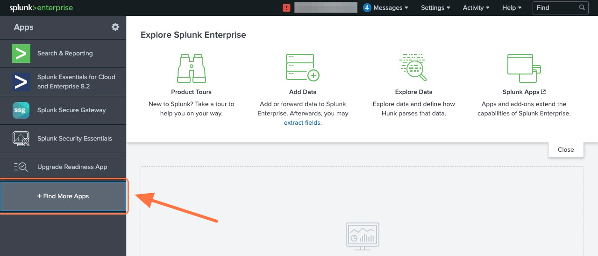

2. Type "**Censys**" in the search bar and press **Enter**.

3. On the results page, find the "Censys ASM App for Splunk" app card and click the green **Install** button.

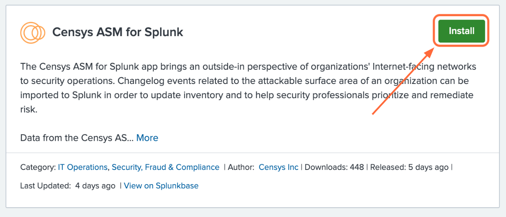

4. Reenter login credentials to confirm your choice.

Install from File
^^^^^^^^^^^^^^^^^

1. Go to the Add-on's page on |splunkbase_app_file| and click the **Download** button.

.. |splunkbase_app_file| raw:: html

    <a href="https://splunkbase.splunk.com/app/4830/" target="_blank">Splunkbase</a>

.. image:: ../_static/download_app.png

2. From the Splunk Web main page, click the gear icon next to **Apps**, then click **Install app from file**.

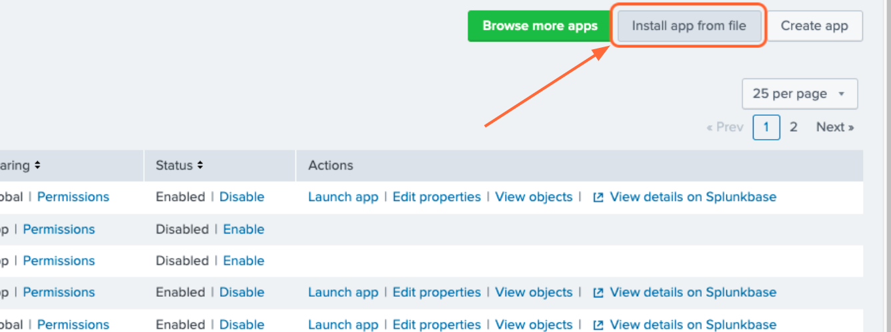

---------

Use the App
-----------

Censys has provided several reports based on ASM data for users to start with.
These reports can be used for alerting and creating dashboards. Workflow actions provide a seamless transition between Splunk Search and Censys ASM.

Create Alerts from Reports
^^^^^^^^^^^^^^^^^^^^^^^^^^

To view the pre-configured reports, click the **Reports** tab at the top of the page.
To create an alert based on a report, click **Open in Search** next to the report you want to use.

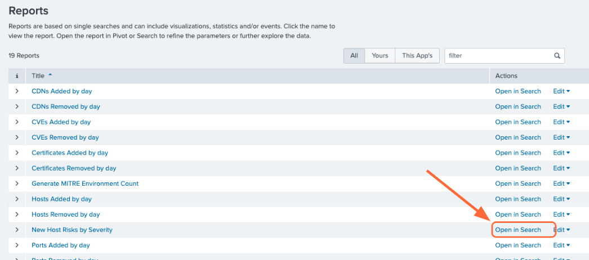

Modify the query to your liking or leave as is, then click **Save As Alert**.

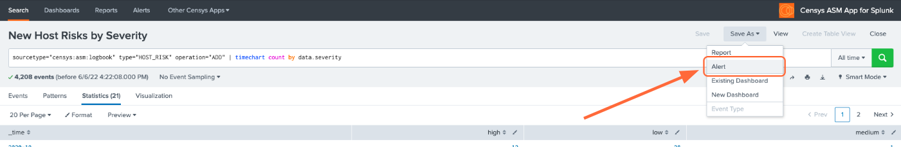

Give your alert a title, set the alert to be scheduled or real-time, and configure the alert's trigger settings and trigger actions.

Interact with Dashboards
^^^^^^^^^^^^^^^^^^^^^^^^

To view the pre-configured dashboards, click the **Dashboards** tab at the top of the page.

The **Censys ASM Logbook** dashboard gives you a broad overview of your attack surface. To view a query in Splunk Search, click on panel.

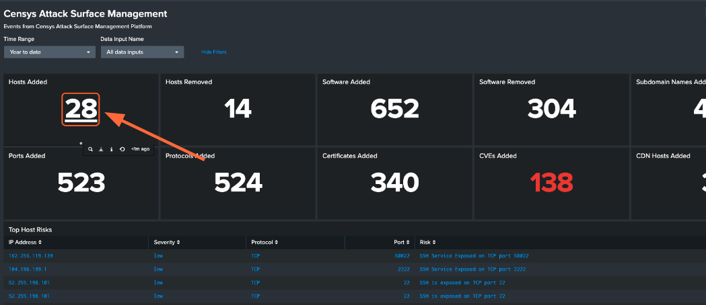

-----

A few more steps are required to enable the pre-configured **Censys ASM Risks** dashboard. In order to keep the dashboard up to date,
we recommend that you enable scheduled runs of the following five saved searches:

- Generate Risk Instances Lookup
- Generate Risk Types Lookup
- Hosts with most risks lookup
- Hosts with most risks with severities
- Hosts with most risks with types

To enable scheduled runs, click the **Settings** tab at the top of the page, then click **Searches, reports, and alerts**.

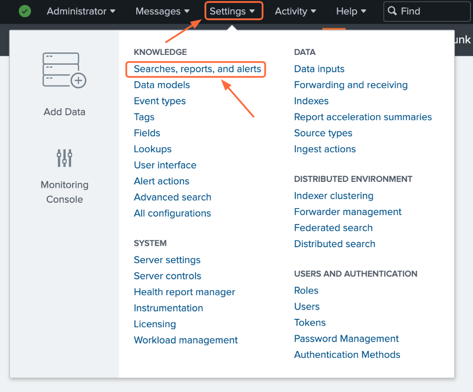

Make sure that the **Owner** filter at the top of the page is set to **All**. For the five saved searches listed above, click **Edit -> Edit Schedule**.

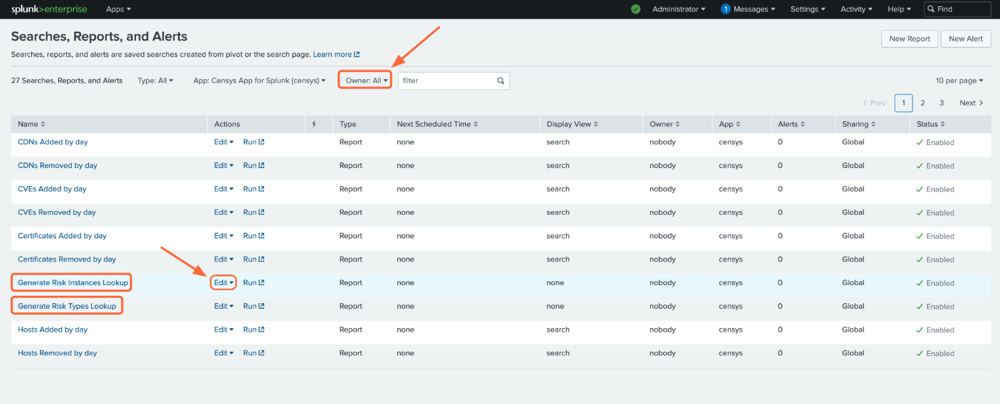

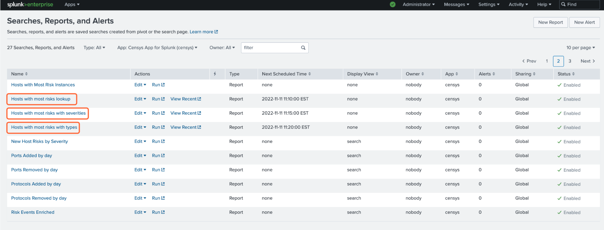

Click the checkbox next to **Schedule Report**. By default, the report will run every hour. You can change this frequency in this window.

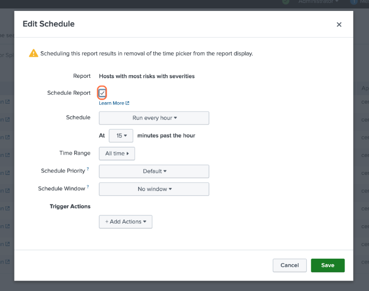

If you'd like to check out the **Censys ASM Risks** dashboard right away, you'll need to manually run each of these five searches by clicking the **Run** button.
Otherwise, the lookup tables will populate according to the schedule you have set.

    If you do not wish to enable scheduled runs, you can still use the **Censys ASM Risks** dashboard, but you will need to manually run each of the five saved searches to pull in current data.

Below are just a few insights you can gain about your attack surface with the **Censys ASM Risks** dashboard:

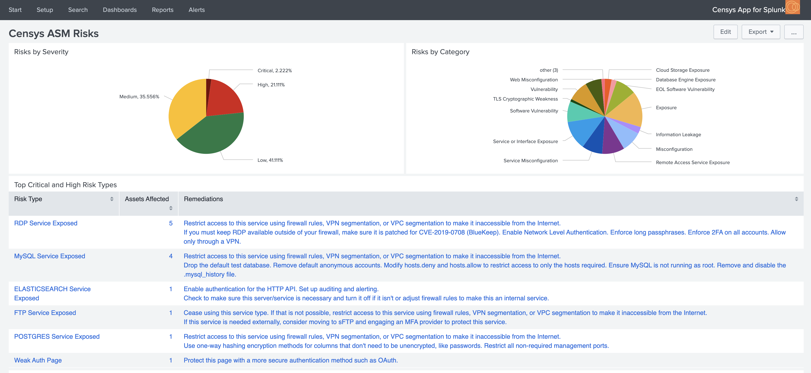

.. image:: ../_static/risks_dashboard_2.png

You can click on any piece of data to view more details in Censys ASM.

Workflow Actions
^^^^^^^^^^^^^^^^

From the events page, click the dropdown to the left of the event's timestamp. This will show all the fields for the event.

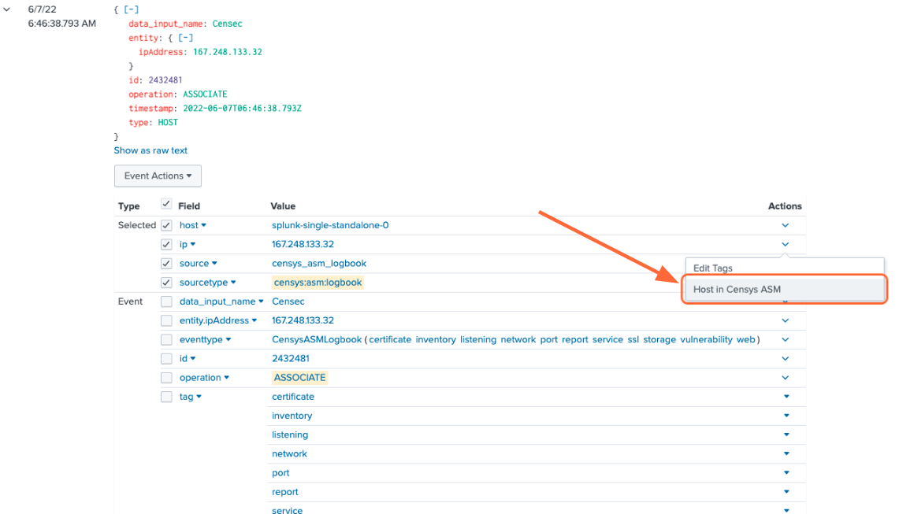

To view more information about an event, click the **Actions** dropdown next to the asset you'd like to view, then **[Domain|Host|Storage Asset|Certificate] in Censys ASM/Search**.

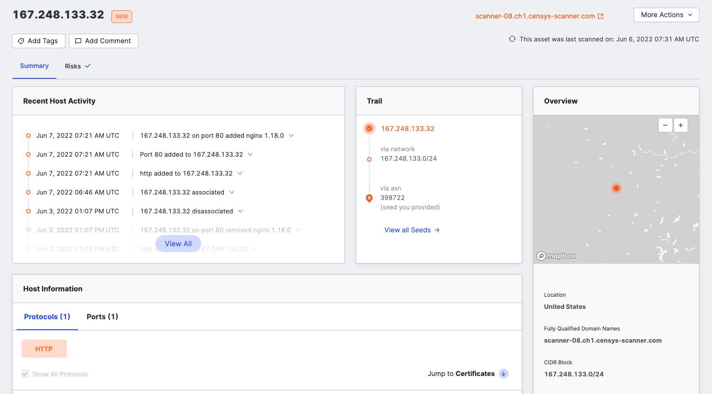

Turn Queries into Reports, Alerts, and Dashboards
^^^^^^^^^^^^^^^^^^^^^^^^^^^^^^^^^^^^^^^^^^^^^^^^^

From Splunk Search, any query can be used to create custom reports, alerts, and dashboards by clicking the **Save As** button in the top right corner.
A query can be added as a new panel to an existing dashboard or a new dashboard can be created.

Create Reports and Alerts from Scratch
^^^^^^^^^^^^^^^^^^^^^^^^^^^^^^^^^^^^^^

One more way to create reports and alerts is by going to **Settings -> Searches, reports, and alerts**.

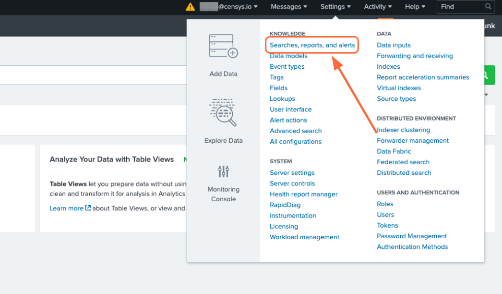

From there, you can manage current reports and alerts, create new reports and alerts from custom queries.

Set a Home Dashboard
^^^^^^^^^^^^^^^^^^^^

Easily check out the Censys ASM dashboard or your own custom dashboard by setting it as your home dashboard.

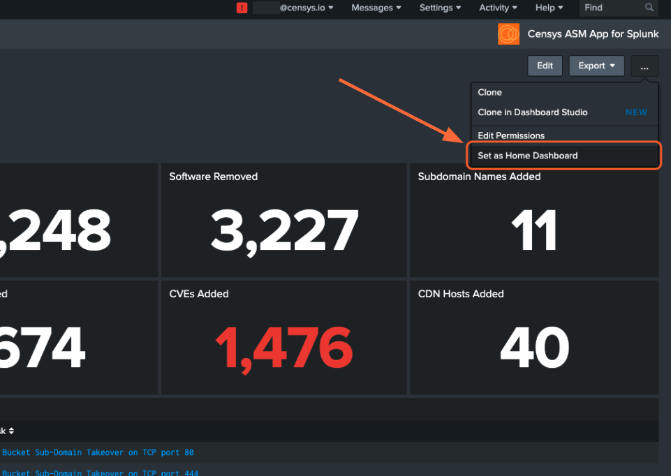

Now, when you open your Splunk Web main page, you'll easily see changes in your attack surface.

Set Up Splunk Event Generator (Eventgen)
^^^^^^^^^^^^^^^^^^^^^^^^^^^^^^^^^^^^^^^^

Splunk Event Generator is a useful tool for generating configurable events to simulate real-time data.
We have provided a sample ``eventgen.conf`` file along with sample events to get you started.

**1. Install and enable the Splunk Eventgen app**

From the Splunk Web main page, click the **+ Find More Apps** button in the sidebar.

Type "**Eventgen**" in the search bar and press **Enter**.

On the results page, find the **Eventgen** app card and click the green **Install** button.

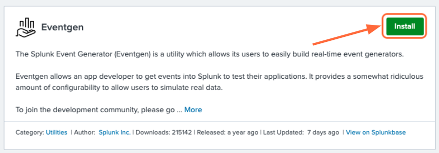

Go to **Settings > Data inputs** and click **Eventgen**.

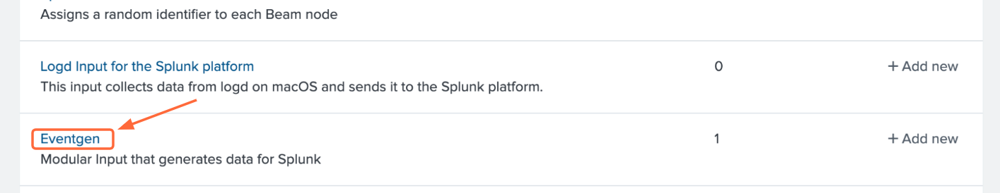

Click **Enable** in the **modinput_eventgen** row.

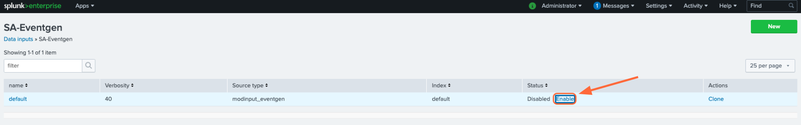

**2. Create an Index**

A new index for your sample events can be created through the Splunk Web UI or the Splunk Enterprise CLI.
Instructions for each option are detailed below.

**Option #1:** Splunk Web UI

Go to **Settings > Indexes**.

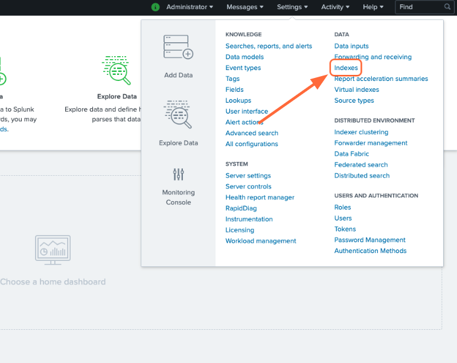

On the Indexes page, click **New Index**.

Enter "**demo**" in the **Index Name** field and select **SA-Eventgen** in the **App** field.

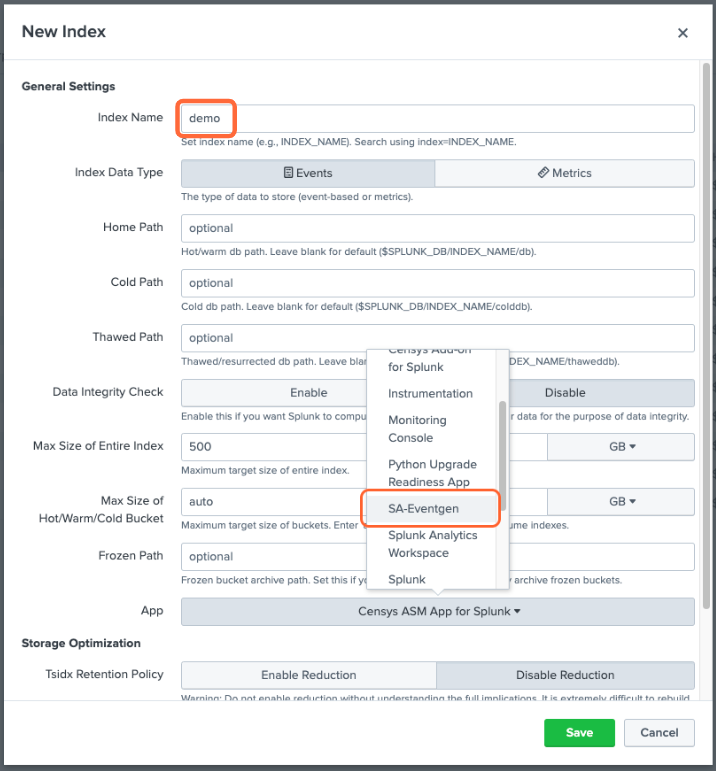

Click **Save**.

**Option #2:** Splunk Enterprise CLI

From the terminal (Mac or Linux), navigate to ``$SPLUNK_HOME/bin`` and enter the following command:
    .. code:: bash

        ./splunk add index demo

You will likely need to enter your Splunk username and password.

    **Note:** If you would like to name your index something other than **demo**, you will need to edit the ``eventgen.conf`` file.

**3. View your Sample Events**

In the Censys ASM App, click the **Search** tab at the top of the page.

Enter the search query ``index=demo`` to see all sample events.

**Additional Resources**

- |eventgen_docs|

.. |eventgen_docs| raw:: html

    <a href="http://splunk.github.io/eventgen/" target="_blank">Splunk Eventgen Documentation</a>

- |eventgen_tutorial|

.. |eventgen_tutorial| raw:: html

    <a href="https://dev.splunk.com/enterprise/tutorials/module_getstarted/useeventgen/" target="_blank">Splunk Dev Eventgen Setup Tutorial</a>

----

Additional information can be found in Splunk documentation:

- |alerting_manual|

.. |alerting_manual| raw:: html

    <a href="https://docs.splunk.com/Documentation/Splunk/9.0.2/Alert/AlertWorkflowOverview" target="_blank">Splunk Alerting Manual</a>

- |reporting_manual|

.. |reporting_manual| raw:: html

    <a href="https://docs.splunk.com/Documentation/Splunk/9.0.2/Report/Createandeditreports" target="_blank">Splunk Reporting Manual</a>

- |search_manual|

.. |search_manual| raw:: html

    <a href="https://docs.splunk.com/Documentation/Splunk/9.0.2/Search/GetstartedwithSearch" target="_blank">Splunk Search Manual</a>
